# DEAA-Hub - Manuel d'utilisation complet

**Plateforme de gestion academique et administrative - IAV Hassan II**

Ce document est le manuel utilisateur en un seul fichier Markdown. Il explique les principales pages de DEAA-Hub, les actions disponibles, les controles a effectuer et les bonnes pratiques d'utilisation. Les captures d'ecran sont stockees dans le dossier `docs/screenshots/`.

## Table des matieres

1. [Presentation generale](#presentation-generale)
2. [Roles et droits d'acces](#roles-et-droits-dacces)
3. [Navigation generale](#navigation-generale)
4. [Connexion](#connexion)
5. [Tableau de bord](#tableau-de-bord)
6. [Etudiants](#etudiants)
7. [Epreuves](#epreuves)
8. [Deliberation](#deliberation)
9. [Laureats](#laureats)
10. [Transferts](#transferts)
11. [Professeurs](#professeurs)
12. [Modules et elements](#modules-et-elements)
13. [Ressources cours](#ressources-cours)
14. [Gestion des classes](#gestion-des-classes)
15. [Cours par classe](#cours-par-classe)
16. [Transfert de classe](#transfert-de-classe)
17. [Emploi du temps](#emploi-du-temps)
18. [Gestion des salles](#gestion-des-salles)
19. [Reservation de salle](#reservation-de-salle)
20. [Departements](#departements)
21. [Filieres](#filieres)
22. [Options](#options)
23. [Cycles](#cycles)
24. [Messages](#messages)
25. [Restauration](#restauration)
26. [Demandes administratives](#demandes-administratives)
27. [Utilisateurs](#utilisateurs)
28. [Statistiques](#statistiques)
29. [Annees academiques](#annees-academiques)
30. [Repas restauration](#repas-restauration)
31. [Types de documents](#types-de-documents)
32. [Roles enseignants](#roles-enseignants)
33. [Grades enseignants](#grades-enseignants)
34. [Types de docs profil](#types-de-docs-profil)
35. [Journaux d'activite](#journaux-dactivite)
36. [Bonnes pratiques](#bonnes-pratiques)
37. [Depannage rapide](#depannage-rapide)
38. [Idees d'amelioration](#idees-damelioration)

---

## Presentation generale

DEAA-Hub centralise la gestion academique et administrative de la Direction de l'Enseignement et des Affaires Academiques. L'application couvre le suivi des etudiants, enseignants, classes, modules, notes, emplois du temps, salles, documents, workflows, messages et restauration.

Les objectifs principaux sont:

- Centraliser les donnees academiques.
- Reduire les doublons et les traitements manuels.
- Ameliorer le suivi des dossiers etudiants et enseignants.
- Donner aux responsables une vision rapide de l'activite.
- Tracer les operations sensibles via les journaux d'activite.

## Roles et droits d'acces

Les pages visibles et les actions disponibles dependent du role de l'utilisateur connecte.

| Role | Utilisation typique | Acces principal |
|---|---|---|
| `admin` | Administrateur plateforme | Acces complet, configuration, utilisateurs, journaux |
| `staff` | Personnel administratif | Gestion courante des donnees academiques |
| `viewer` | Consultation | Lecture des donnees autorisees |
| `user` | Utilisateur departemental | Donnees limitees aux departements attribues |
| `teacher` | Enseignant | Consultation et actions pedagogiques autorisees |
| `student` | Etudiant | Donnees personnelles, ressources, restauration selon configuration |
| `inspector` | Controle ou inspection | Consultation par perimetre |
| `restauration` | Agent restauration | Gestion repas, tickets, soldes et transactions |

Point important: les departements attribues a un compte limitent la visibilite sur plusieurs pages, notamment etudiants, classes, filieres, modules, salles et reservations.

## Navigation generale

L'interface est organisee autour de deux zones principales:

- **Barre laterale gauche**: acces aux modules par groupe fonctionnel.
- **Barre superieure**: informations de session, notifications, profil et deconnexion.

Les groupes de navigation sont:

| Groupe | Pages principales |
|---|---|
| Accueil | Tableau de bord |
| Etudiants | Etudiants, Epreuves, Deliberation, Laureats, Transferts |
| Enseignants | Professeurs |
| Structure academique | Modules et elements, Ressources cours |
| Classes | Gestion des classes, Cours par classe, Transfert de classe |
| Emploi du temps et salles | Emploi du temps, Salles, Reservations |
| Structure organisationnelle | Departements, Filieres, Options, Cycles |
| Communication et services | Messages, Restauration, Demandes |
| Administration | Utilisateurs, Statistiques, Parametres, Journaux |

---

## Connexion


**Lien:** `/login`

### Objectif

La page de connexion permet d'acceder a DEAA-Hub avec un identifiant et un mot de passe.

### Procedure

1. Saisir le username ou l'adresse email.
2. Saisir le mot de passe.
3. Cliquer sur **Se connecter**.
4. Attendre la redirection vers le tableau de bord.

### A verifier

- L'identifiant est correct.
- Le mot de passe correspond au compte.
- Le compte n'a pas ete desactive ou supprime.
- Le backend est disponible si la connexion echoue sans message clair.

---

## Tableau de bord


**Lien:** `/dashboard`

### Objectif

Le tableau de bord donne une vue globale de l'activite academique et administrative.

### Ce que l'on trouve sur cette page

- Indicateurs globaux: etudiants, enseignants, classes, filieres, departements, documents.
- Graphiques de repartition.
- Activite recente.
- Actions rapides vers les pages les plus utilisees.

### Utilisation recommandee

1. Ouvrir le tableau de bord au debut de la journee.
2. Verifier les indicateurs principaux.
3. Consulter l'activite recente pour detecter les changements importants.
4. Utiliser les actions rapides pour rejoindre la page souhaitee.

### Points de controle

- Si les chiffres semblent incomplets, verifier les filtres de role/departement.
- Les donnees du tableau de bord dependent de la qualite des informations saisies dans les autres modules.

---

## Etudiants


**Lien:** `/students`

### Objectif

La page Etudiants centralise les dossiers des apprenants.

### Actions disponibles

- Rechercher un etudiant par nom, code Massar, CIN, email ou telephone.
- Filtrer par departement, filiere, cycle, option ou classe.
- Ajouter un nouvel etudiant.
- Importer des etudiants depuis un fichier.
- Modifier un dossier existant.
- Ouvrir le profil detaille d'un etudiant.
- Marquer ou suivre le statut de laureat.
- Supprimer un dossier si le role le permet.

### Donnees importantes

- Nom et prenom.
- Code Massar.
- CIN.
- Email et telephone.
- Filiere, option, cycle et classe.
- Annee academique.
- Statut academique.

### Bonnes pratiques

- Toujours verifier le code Massar et la CIN avant creation.
- Eviter les doublons en utilisant la recherche avant d'ajouter un etudiant.
- Mettre a jour la classe apres les transferts ou passages d'annee.

---

## Epreuves

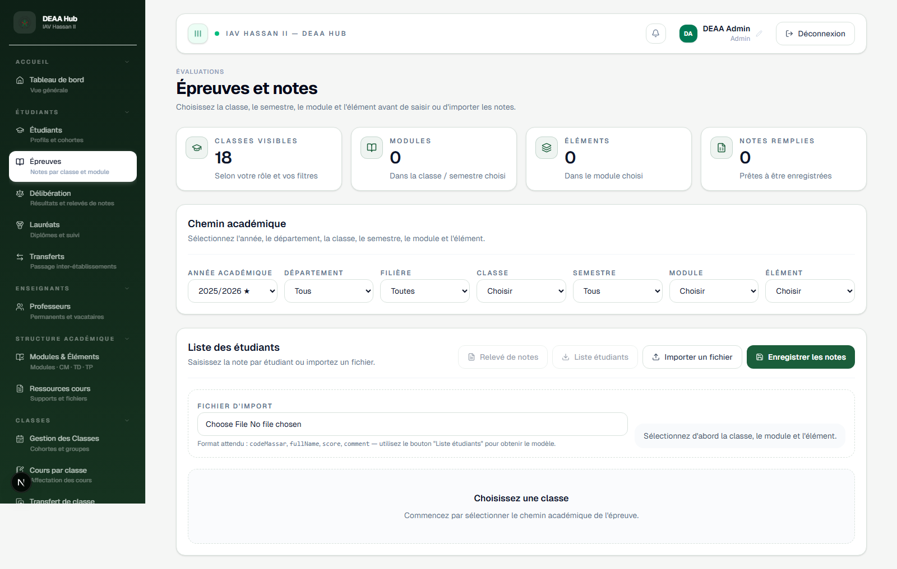

**Lien:** `/grades`

### Objectif

La page Epreuves permet de saisir, consulter et corriger les notes par classe, module et element.

### Procedure de saisie

1. Choisir le departement, la filiere, l'option et la classe.
2. Selectionner le module ou l'element concerne.
3. Creer ou ouvrir l'epreuve.
4. Saisir les notes.
5. Verifier les absences, notes manquantes et valeurs hors bareme.
6. Enregistrer.

### Points de controle

- La classe selectionnee est correcte.
- Le module correspond bien a l'epreuve.
- Les coefficients et baremes ont ete controles dans la structure academique.
- Les notes sont pretes avant la deliberation.

---

## Deliberation

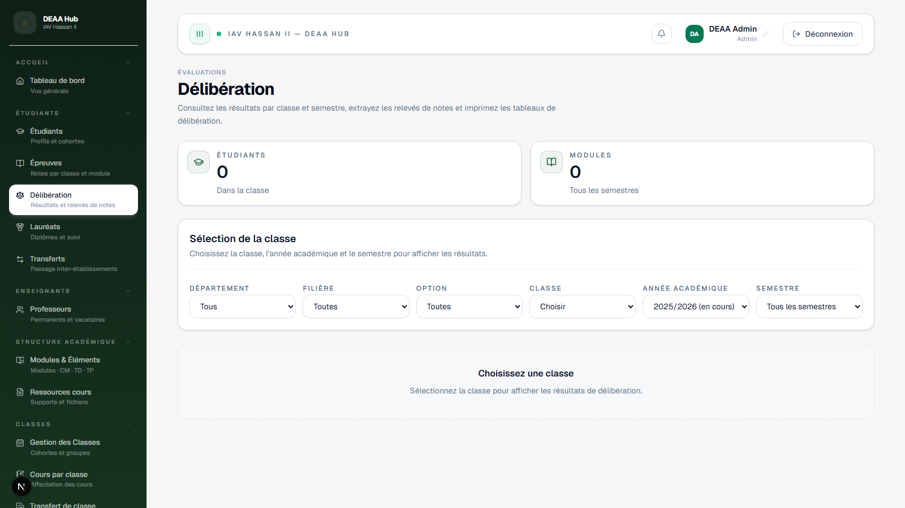

**Lien:** `/deliberation`

### Objectif

La page Deliberation consolide les resultats d'une classe et aide a preparer les decisions academiques.

### Utilisation

- Selectionner la classe ou le contexte academique.
- Consulter les moyennes et resultats.
- Identifier les notes manquantes ou incoherentes.
- Preparer les decisions.
- Exporter ou imprimer les resultats si l'action est disponible.

### Avant validation

- Verifier que toutes les epreuves sont saisies.
- Controler les coefficients des modules et elements.
- Confirmer que les etudiants appartiennent a la bonne classe.

---

## Laureats

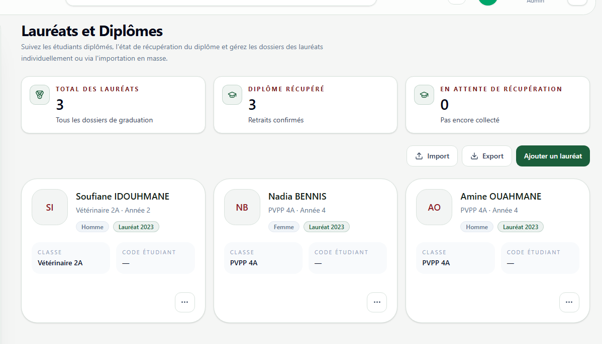

**Lien:** `/laureates`

### Objectif

La page Laureats assure le suivi des diplomes et des anciens etudiants diplomes.

### Actions disponibles

- Consulter la liste des laureats.
- Rechercher par nom, filiere ou annee.
- Creer ou modifier un dossier laureat.
- Suivre le statut de remise du diplome.
- Exporter les donnees si l'action est disponible.

### Bonnes pratiques

- Renseigner l'annee de graduation avec precision.
- Eviter de creer un laureat sans verifier le dossier etudiant source.
- Mettre a jour le statut du diplome apres remise.

---

## Transferts

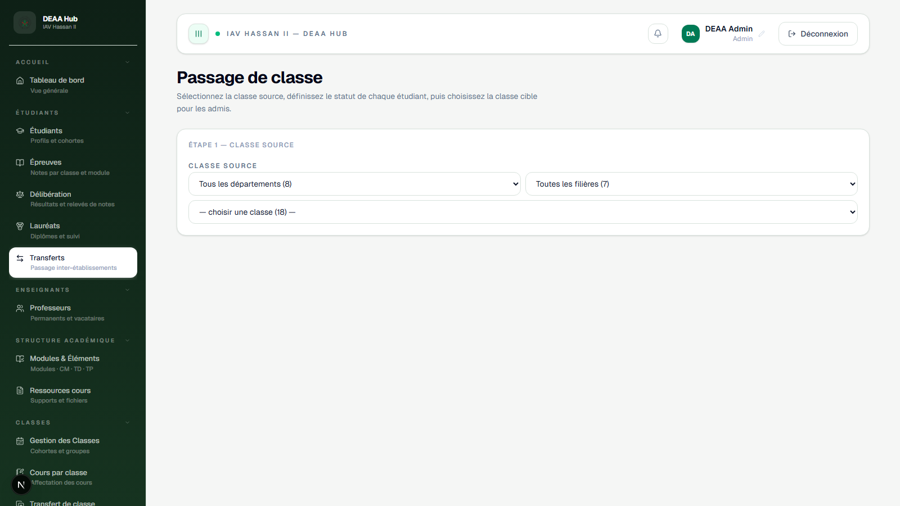

**Lien:** `/transfers`

### Objectif

La page Transferts gere le passage des etudiants d'une classe vers une autre ou vers une nouvelle annee academique.

### Procedure generale

1. Selectionner la classe source.
2. Verifier la liste des etudiants.
3. Definir le statut de chaque etudiant.
4. Choisir la classe cible.
5. Choisir la nouvelle annee academique.
6. Valider l'operation.

### Points de vigilance

- Une erreur de classe cible impacte les effectifs, notes et statistiques.
- Les transferts doivent etre faits apres verification des resultats.
- Garder une trace de l'operation via les journaux d'activite.

---

## Professeurs

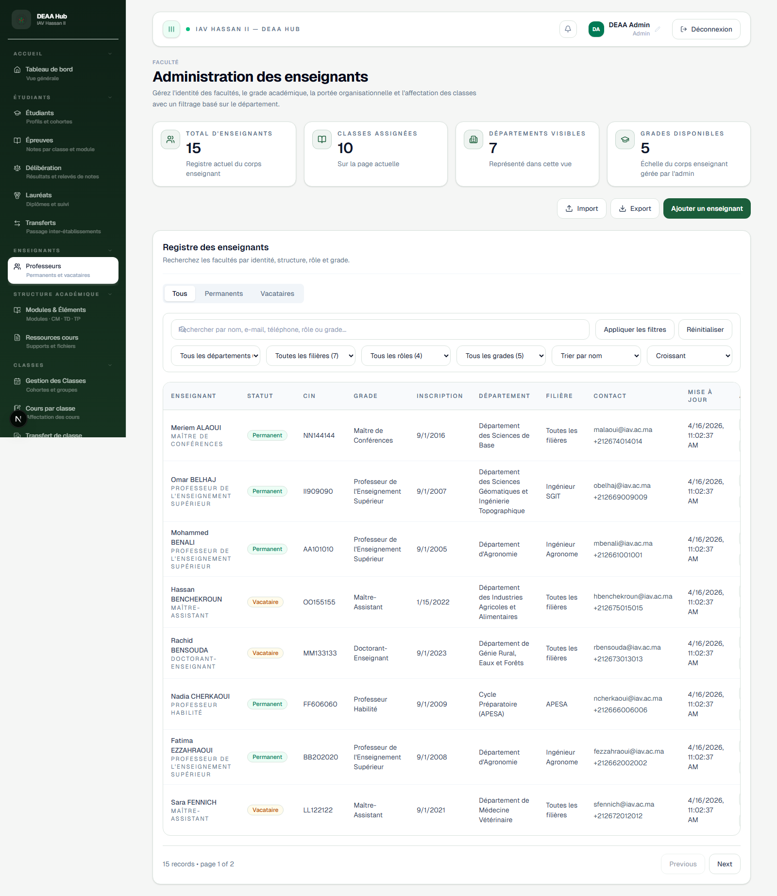

**Lien:** `/teachers`

### Objectif

La page Professeurs gere les enseignants permanents, vacataires et leurs rattachements.

### Actions disponibles

- Rechercher un enseignant.
- Filtrer par departement, filiere, role ou grade.
- Ajouter un enseignant.
- Modifier les informations administratives.
- Consulter le profil de l'enseignant.
- Importer ou exporter les donnees si disponible.

### Informations importantes

- Nom et prenom.
- CIN.
- Email et telephone.
- Departement et filiere.
- Role enseignant.
- Grade enseignant.

### Bonnes pratiques

- Maintenir les roles et grades a jour dans les parametres.
- Verifier les rattachements avant d'affecter des cours.
- Eviter les doublons sur CIN ou email.

---

## Modules et elements


**Lien:** `/academic`

### Objectif

Cette page definit la structure pedagogique: modules, elements, coefficients, volumes horaires et liens avec les classes.

### Actions disponibles

- Creer un module.
- Ajouter des elements de module.
- Definir les types d'enseignement: CM, TD, TP ou autre.
- Gerer les coefficients et volumes horaires.
- Assigner les modules aux classes.

### Impact dans l'application

Les modules et elements alimentent:

- Cours par classe.
- Emploi du temps.
- Epreuves et notes.
- Deliberation.
- Ressources cours.

### Bonnes pratiques

- Utiliser des codes de module coherents.
- Controler les coefficients avant la saisie des notes.
- Eviter de supprimer un module deja utilise.

---

## Ressources cours

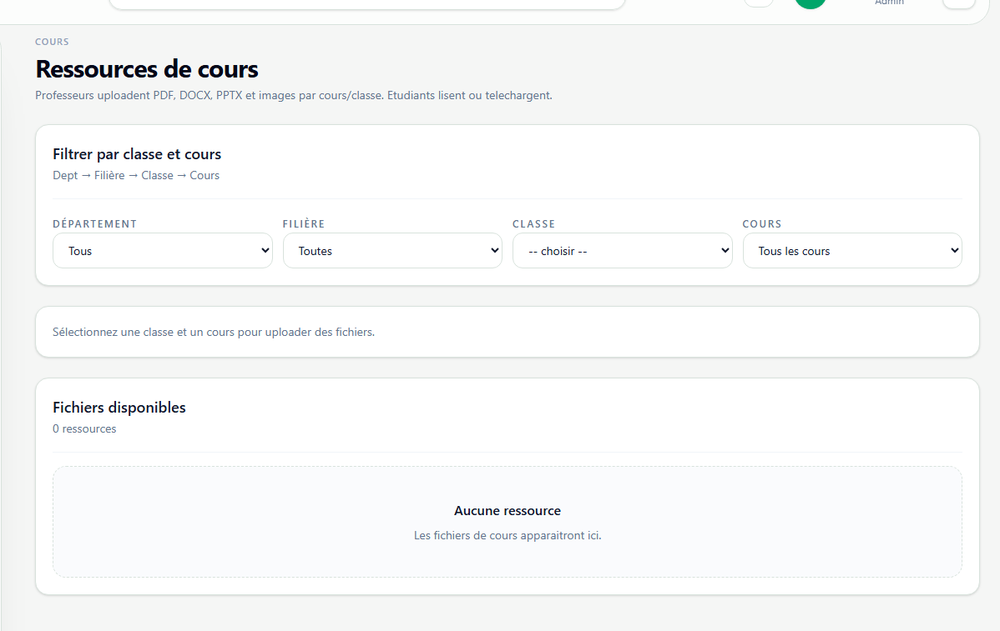

**Lien:** `/cours-resources`

### Objectif

La page Ressources cours centralise les supports pedagogiques.

### Actions disponibles

- Filtrer les ressources par classe, module ou cours.
- Ajouter un support.
- Modifier les informations d'un fichier.
- Telecharger ou ouvrir un fichier.
- Supprimer une ressource obsolete selon les droits.

### Types de fichiers typiques

- PDF de cours.
- Presentations.
- Documents de TD/TP.
- Images ou schemas.
- Supports administratifs de cours.

### Bonnes pratiques

- Donner un nom clair aux fichiers.
- Rattacher chaque ressource a la bonne classe et au bon cours.
- Supprimer les versions obsoletes pour eviter la confusion.

---

## Gestion des classes

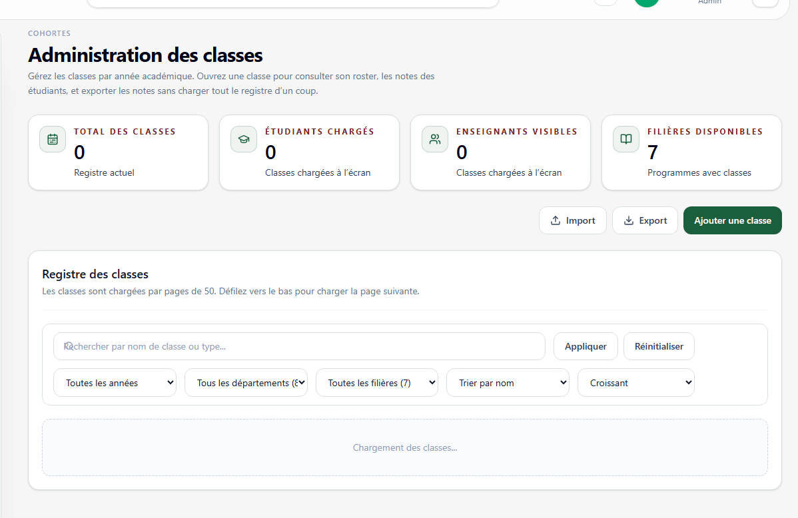

**Lien:** `/classes`

### Objectif

La page Classes gere les cohortes, groupes et niveaux d'etudes.

### Actions disponibles

- Creer une classe.
- Rattacher la classe a une filiere, option, cycle et annee.
- Consulter les effectifs.
- Modifier une classe existante.
- Supprimer une classe inutilisee selon les droits.

### Points de controle

- Le nom de la classe est clair.
- L'annee academique est correcte.
- La filiere et l'option sont exactes.
- Les effectifs correspondent aux dossiers etudiants.

---

## Cours par classe


**Lien:** `/classes/cours`

### Objectif

Cette page affecte les cours et enseignants a une classe.

### Procedure

1. Choisir une classe.
2. Ajouter les elements de modules concernes.
3. Assigner les enseignants.
4. Verifier la coherence du plan pedagogique.
5. Enregistrer les affectations.

### Impact

Les affectations sont reutilisees par:

- Emploi du temps.
- Notes et epreuves.
- Charge pedagogique des enseignants.
- Ressources cours.

---

## Transfert de classe

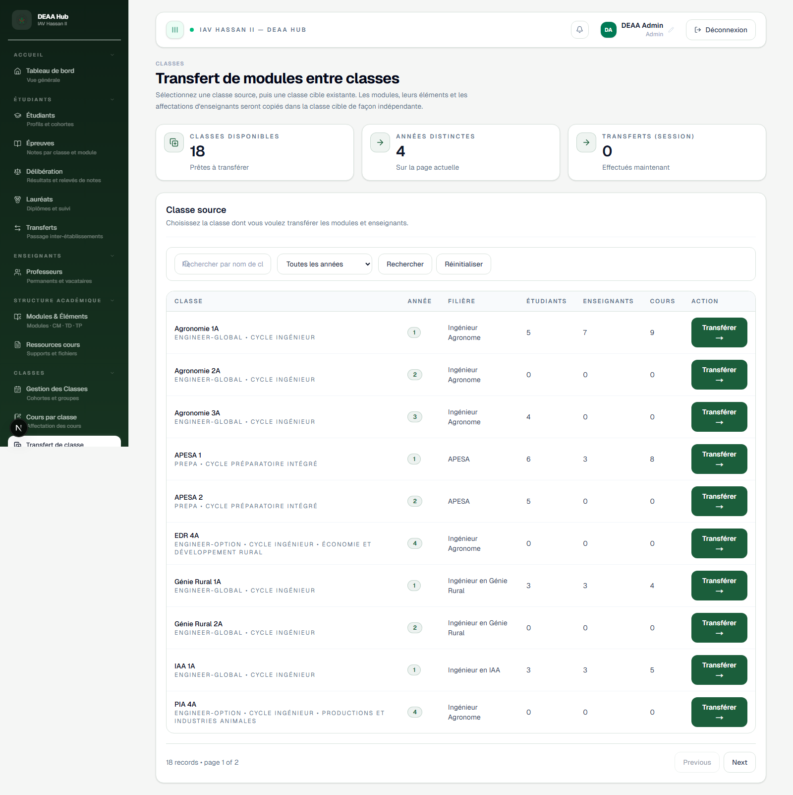

**Lien:** `/classes/transfer`

### Objectif

Le transfert de classe sert a cloner ou preparer la structure d'une classe pour une autre annee academique.

### Utilisation

- Choisir la classe source.
- Definir la classe ou l'annee cible.
- Selectionner les elements a reprendre.
- Lancer le transfert.

### Difference avec la page Transferts

| Page | Usage |
|---|---|
| `/transfers` | Passage ou deplacement des etudiants |
| `/classes/transfer` | Reprise de la structure pedagogique d'une classe |

---

## Emploi du temps

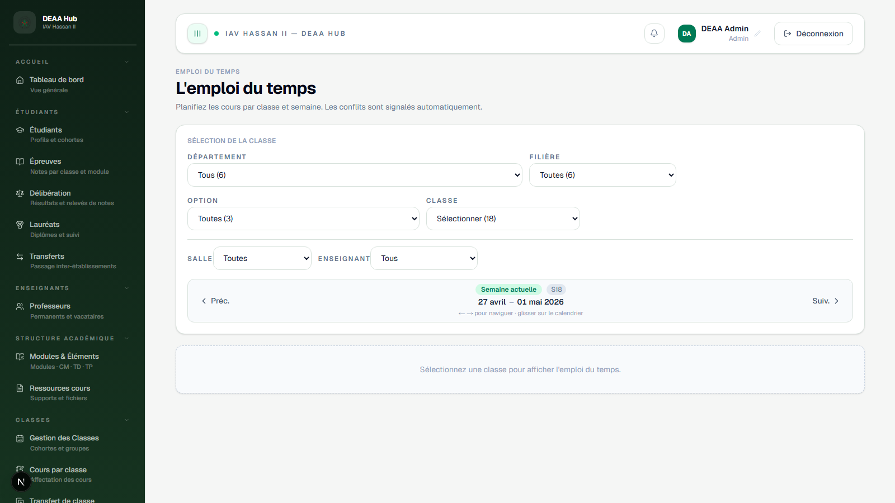

**Lien:** `/timetable`

### Objectif

La page Emploi du temps planifie les seances d'enseignement.

### Actions disponibles

- Choisir une classe ou une semaine.
- Ajouter une seance.
- Selectionner le cours, l'enseignant, la salle et le creneau.
- Modifier une seance.
- Supprimer une seance.
- Verifier les conflits.

### Points de vigilance

- Une salle ne doit pas etre reservee deux fois au meme creneau.
- Un enseignant ne doit pas etre affecte a deux seances simultanees.
- Les cours doivent etre correctement affectes a la classe avant planification.

---

## Gestion des salles

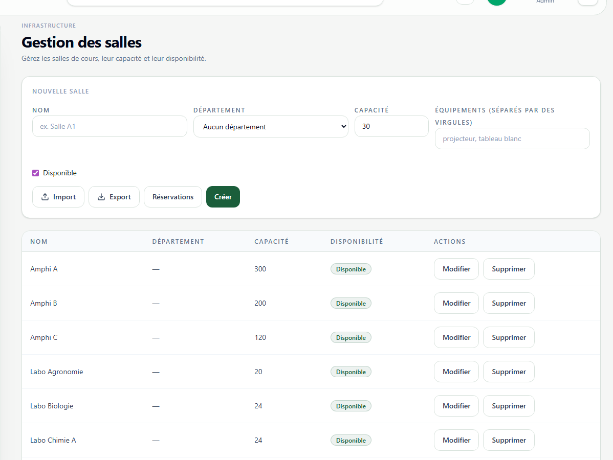

**Lien:** `/rooms`

### Objectif

La page Salles gere les espaces physiques de l'etablissement.

### Actions disponibles

- Ajouter une salle.
- Renseigner la capacite.
- Indiquer les equipements.
- Rattacher la salle a un departement si necessaire.
- Modifier ou supprimer une salle.

### Exemples d'equipements

- Projecteur.
- Tableau.
- Ordinateurs.
- Materiel de laboratoire.
- Connexion internet.

---

## Reservation de salle

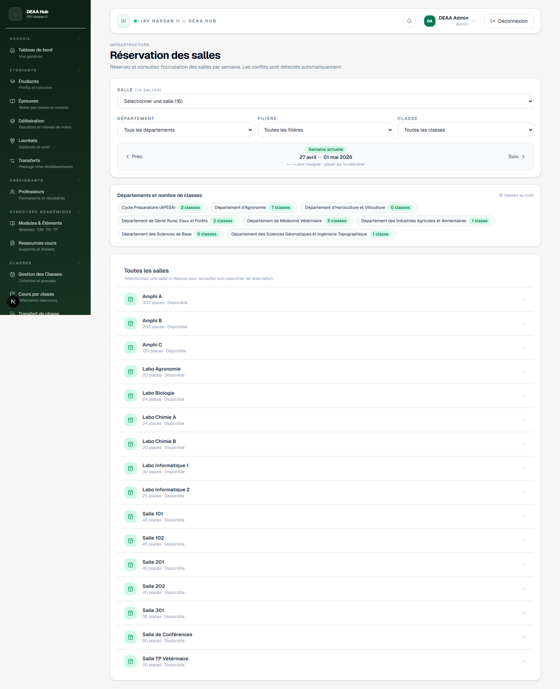

**Lien:** `/room-reservations`

### Objectif

Cette page gere les demandes de reservation et l'occupation des salles.

### Actions disponibles

- Creer une reservation.
- Consulter les reservations existantes.
- Approuver une demande.
- Rejeter une demande avec motif.
- Annuler une reservation.

### Statuts courants

| Statut | Signification |
|---|---|
| En attente | La demande attend une validation |
| Approuvee | La reservation est confirmee |
| Rejetee | La demande est refusee |
| Annulee | La reservation n'est plus active |

---

## Departements

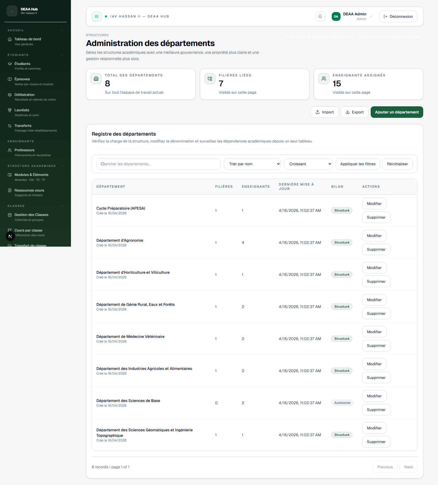

**Lien:** `/departments`

### Objectif

La page Departements gere les structures internes de l'etablissement.

### Actions disponibles

- Creer un departement.
- Modifier le nom ou le code.
- Consulter les filieres rattachees.
- Supprimer un departement inutilise.

### Impact

Les departements influencent:

- Les droits d'acces.
- Les filtres de donnees.
- Les filieres.
- Les salles.
- Les tableaux de bord par perimetre.

---

## Filieres

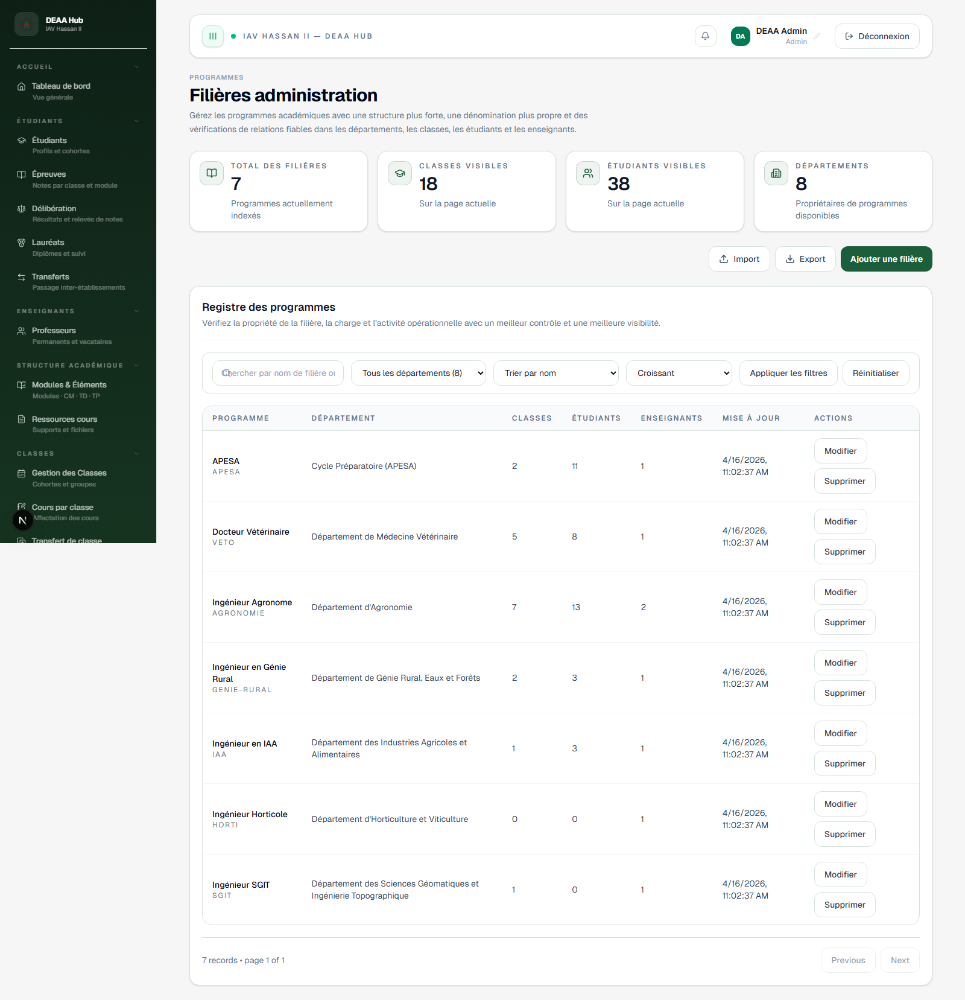

**Lien:** `/filieres`

### Objectif

La page Filieres gere les programmes de formation.

### Actions disponibles

- Ajouter une filiere.
- Rattacher une filiere a un departement.
- Modifier son nom, code ou description.
- Suivre les classes et options associees.

### Bonnes pratiques

- Utiliser un code unique par filiere.
- Rattacher chaque filiere au bon departement.
- Eviter de modifier une filiere sans mesurer l'impact sur les classes et statistiques.

---

## Options

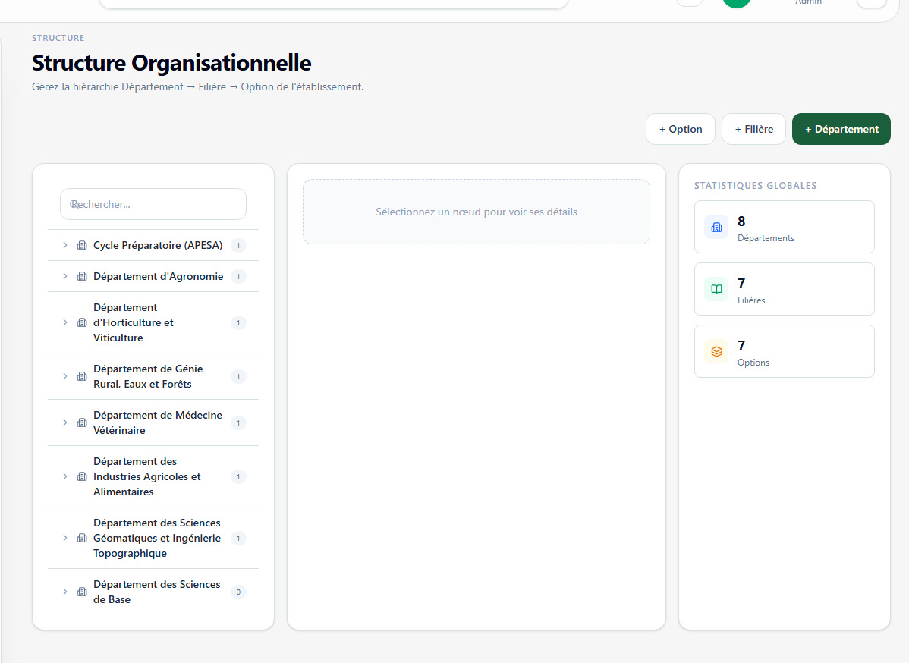

**Lien:** `/structure`

### Objectif

La page Options gere les specialites ou parcours rattaches aux filieres.

### Actions disponibles

- Creer une option.
- Lier l'option a une filiere.
- Modifier une option.
- Supprimer une option inutilisee.

### Hierarchie academique

```txt
Departement
  -> Filiere
     -> Option
        -> Classe
           -> Etudiant
```

---

## Cycles

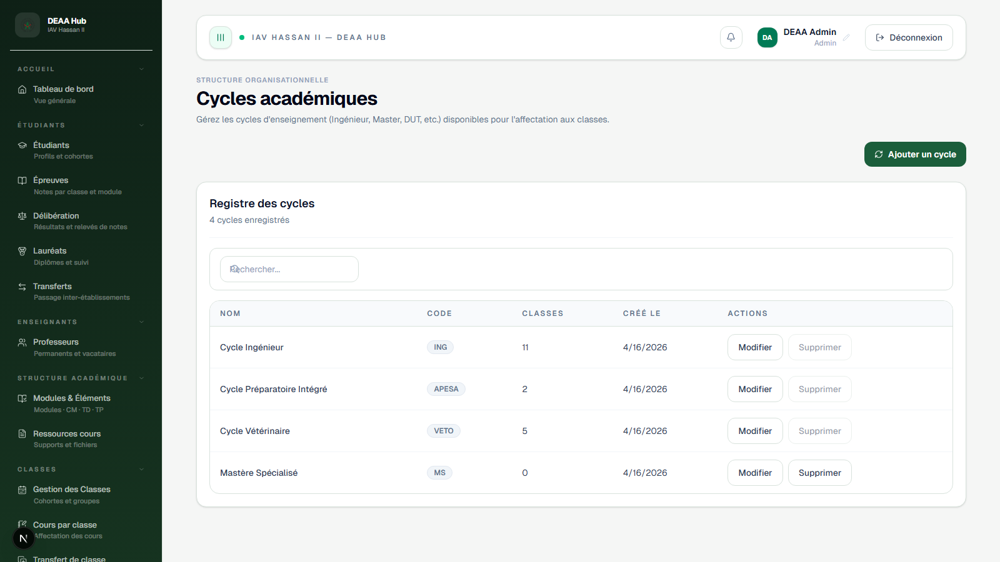

**Lien:** `/cycles`

### Objectif

La page Cycles gere les grands niveaux de formation.

### Actions disponibles

- Creer un cycle.
- Modifier son nom ou son code.
- Supprimer un cycle inutilise.

### Exemples

- Cycle preparatoire.
- Cycle ingenieur.
- Cycle veterinaire.
- Master ou formation specialisee selon configuration.

---

## Messages

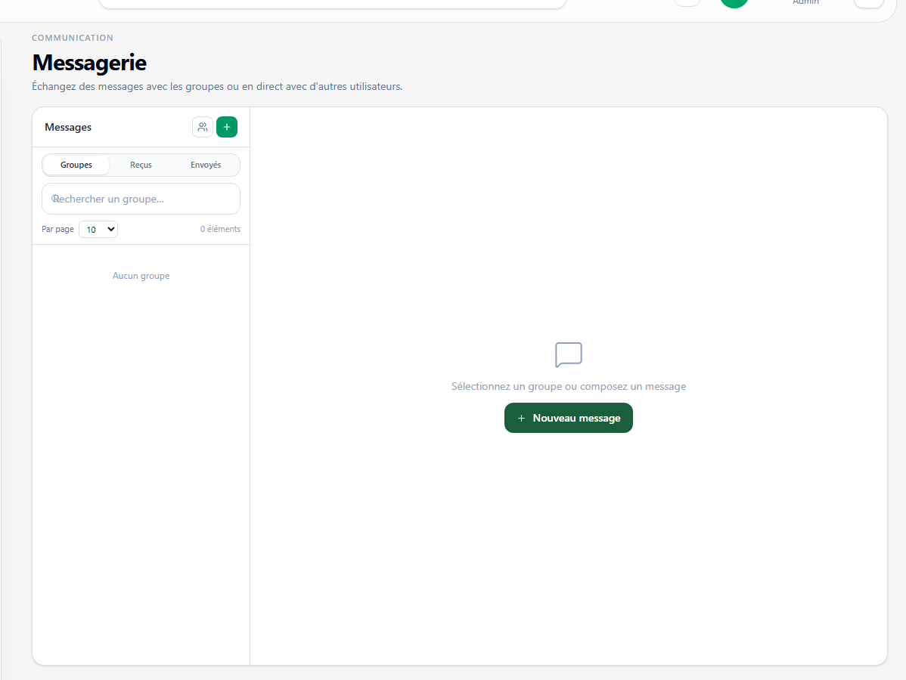

**Lien:** `/messages`

### Objectif

La page Messages permet les conversations internes et la communication par groupes.

### Actions disponibles

- Consulter la boite de reception.
- Ouvrir une conversation.
- Envoyer un message.
- Creer ou administrer un groupe selon les droits.
- Gerer les membres et permissions d'envoi si disponible.

### Bonnes pratiques

- Utiliser les groupes pour les communications recurrentes.
- Eviter de diffuser des informations sensibles a un groupe trop large.
- Verifier les destinataires avant envoi.

---

## Restauration

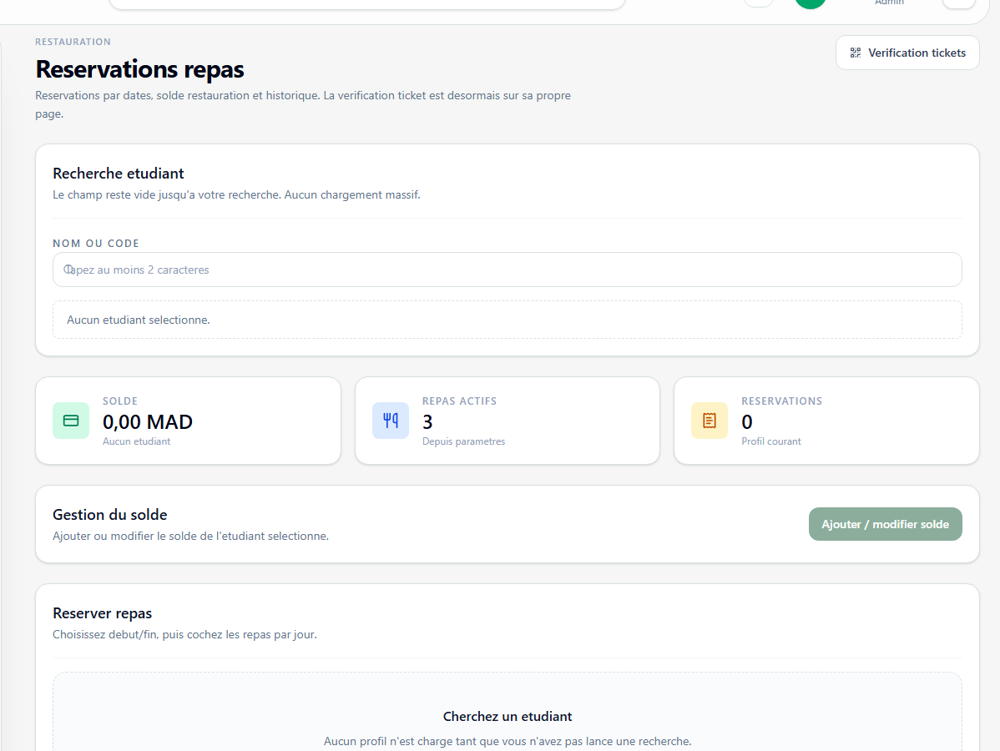

**Lien:** `/restauration`

### Objectif

La page Restauration gere les repas, soldes, reservations, tickets et transactions.

### Actions disponibles

- Rechercher un etudiant.
- Consulter le solde restauration.
- Crediter ou ajuster un solde selon les droits.
- Reserver un ou plusieurs repas.
- Emettre ou consulter un ticket.
- Suivre les transactions.
- Acceder a la verification des tickets.

### Points de controle

- Verifier l'identite de l'etudiant avant modification du solde.
- Controler les montants avant validation.
- Garder les tickets et transactions traces.

---

## Demandes administratives

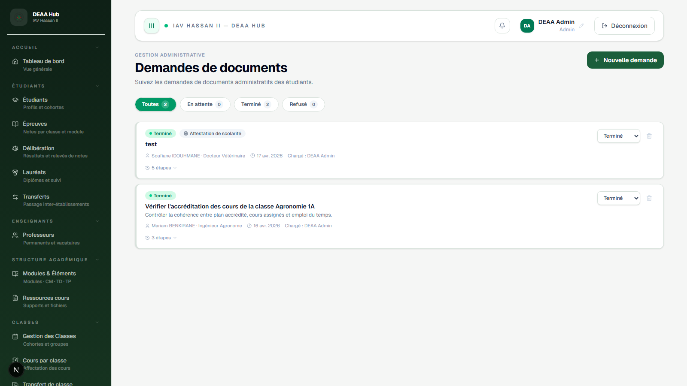

**Lien:** `/workflows`

### Objectif

La page Demandes suit les workflows administratifs et les demandes de documents.

### Actions disponibles

- Creer une demande.
- Assigner un responsable.
- Lier la demande a un etudiant ou a un dossier.
- Suivre le statut.
- Ajouter les informations necessaires.
- Cloturer la demande.

### Statuts possibles

Les statuts peuvent varier selon la configuration, mais suivent generalement:

- Nouveau.
- En cours.
- En attente.
- Termine.
- Annule.

---

## Utilisateurs


**Lien:** `/users`

### Objectif

La page Utilisateurs gere les comptes, roles et perimetres d'acces.

### Actions disponibles

- Creer un compte utilisateur.
- Attribuer un role.
- Assigner un ou plusieurs departements.
- Modifier les informations du compte.
- Reinitialiser ou changer un mot de passe si disponible.
- Supprimer ou desactiver un compte selon les droits.

### Bonnes pratiques de securite

- Donner uniquement les droits necessaires.
- Limiter les comptes admin aux responsables habilites.
- Retirer l'acces des utilisateurs qui quittent le service.
- Verifier les departements attribues.

---

## Statistiques

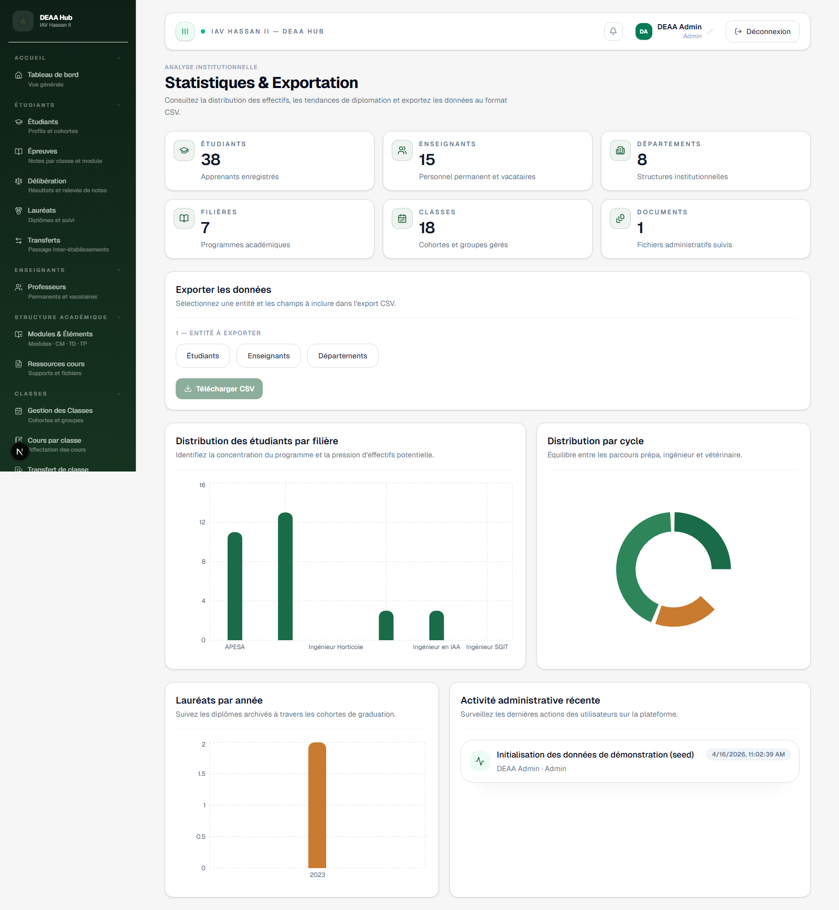

**Lien:** `/statistics`

### Objectif

La page Statistiques permet de consulter les donnees consolidees et d'exporter des rapports.

### Utilisation

- Choisir une categorie de donnees.
- Appliquer les filtres disponibles.
- Consulter les indicateurs.
- Exporter les donnees au format propose.

### Bonnes pratiques

- Verifier les filtres avant export.
- Nommer les fichiers exportes avec une date.
- Utiliser les exports pour les reunions, audits et rapports de direction.

---

## Annees academiques

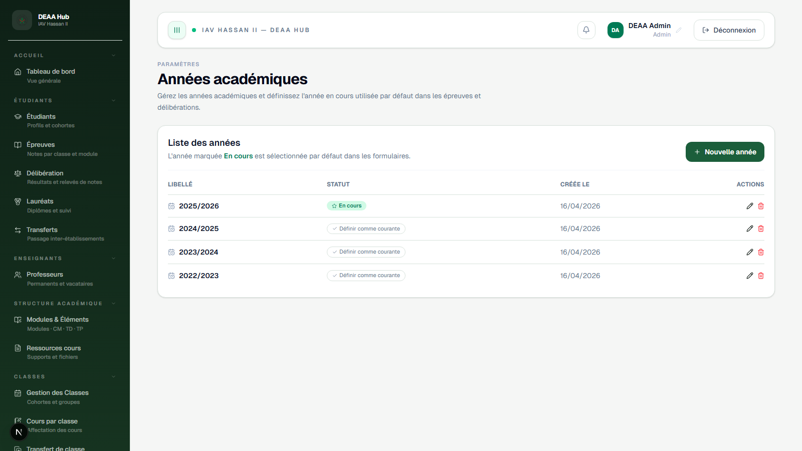

**Lien:** `/settings/academic-years`

### Objectif

Cette page configure les annees academiques disponibles dans l'application.

### Actions disponibles

- Ajouter une annee academique.
- Modifier un libelle.
- Definir une annee active si l'interface le permet.
- Supprimer une annee inutilisee.

### Bonnes pratiques

- Utiliser un format stable, par exemple `2025/2026`.
- Eviter de supprimer une annee deja utilisee.
- Verifier l'annee active avant les inscriptions ou transferts.

---

## Repas restauration

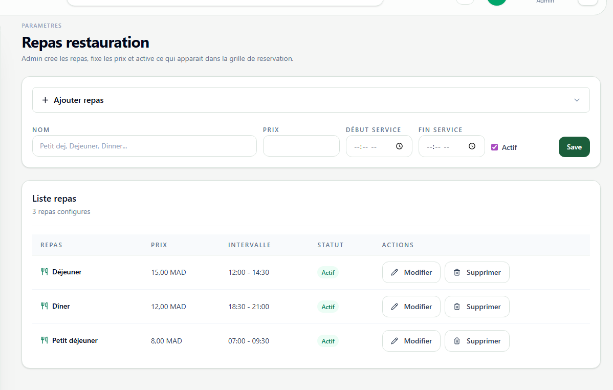

**Lien:** `/settings/restauration`

### Objectif

Cette page configure les repas, prix et disponibilites de la restauration.

### Actions disponibles

- Ajouter un repas.
- Definir le prix.
- Activer ou desactiver un repas.
- Modifier les informations d'un repas existant.

### Points de controle

- Verifier les prix avant ouverture des reservations.
- Desactiver les repas indisponibles.
- Controler les modifications avant les periodes de forte activite.

---

## Types de documents

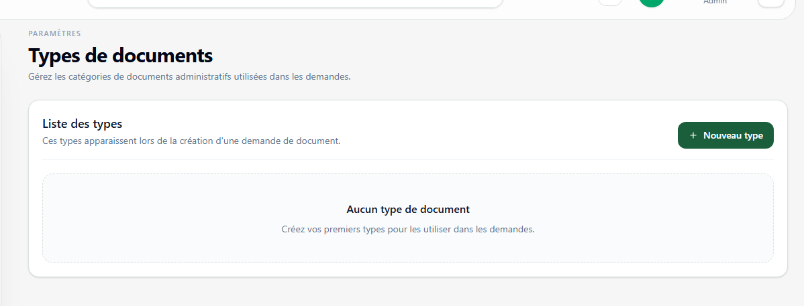

**Lien:** `/settings/document-types`

### Objectif

Cette page configure les categories de documents administratifs.

### Actions disponibles

- Creer un type de document.
- Modifier le libelle.
- Supprimer un type inutilise.
- Utiliser les types dans les demandes et dossiers.

### Exemples

- Attestation de scolarite.
- Releve de notes.
- Diplome.
- Certificat administratif.

---

## Roles enseignants

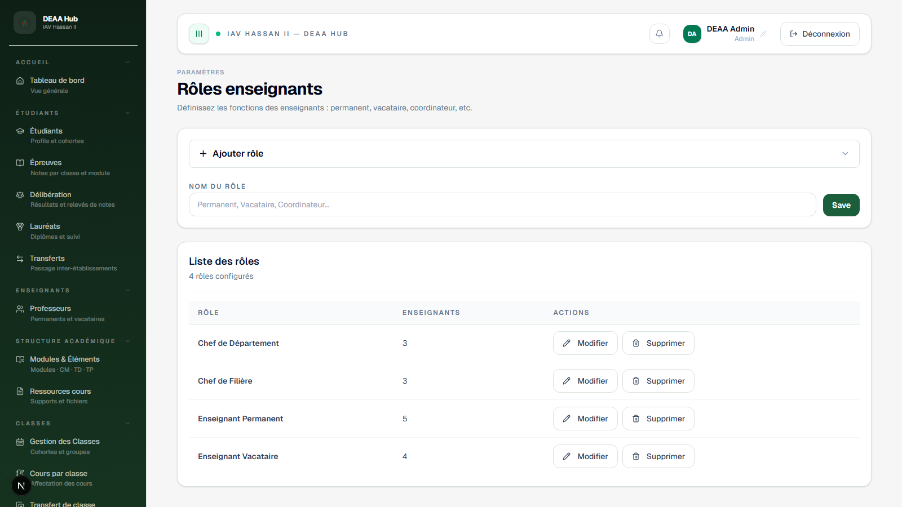

**Lien:** `/settings/teacher-roles`

### Objectif

Cette page gere les fonctions ou responsabilites attribuees aux enseignants.

### Actions disponibles

- Ajouter un role enseignant.
- Modifier le libelle.
- Supprimer un role inutilise.
- Utiliser le role dans les fiches professeurs.

### Exemples

- Enseignant.
- Coordinateur.
- Chef de filiere.
- Chef de departement.
- Vacataire.

---

## Grades enseignants

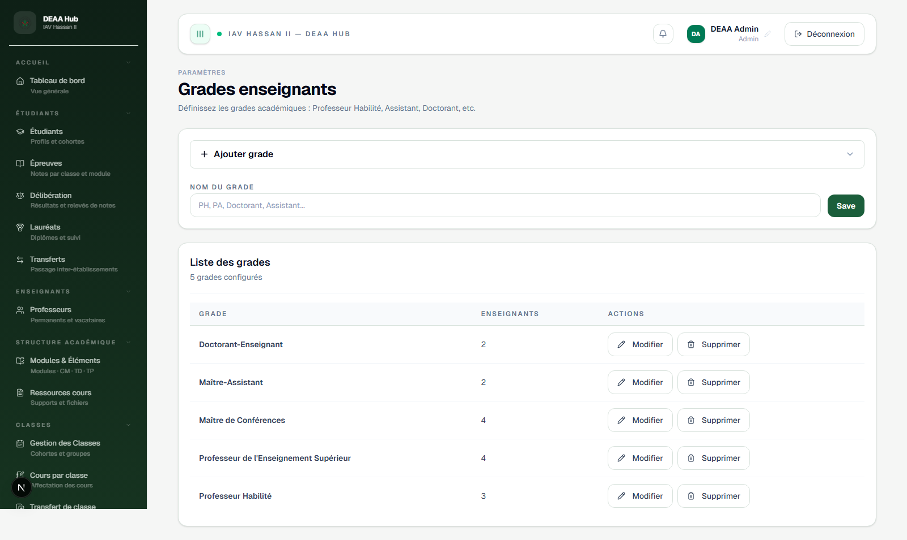

**Lien:** `/settings/teacher-grades`

### Objectif

Cette page configure les grades academiques des enseignants.

### Actions disponibles

- Ajouter un grade.
- Modifier le libelle.
- Supprimer un grade inutilise.
- Affecter le grade depuis la fiche professeur.

### Exemples

- Professeur habilite.
- Maitre assistant.
- Assistant.
- Doctorant.
- Vacataire.

---

## Types de docs profil

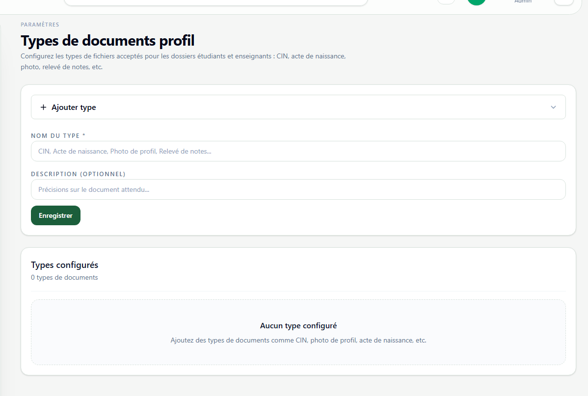

**Lien:** `/settings/profile-document-types`

### Objectif

Cette page configure les documents attendus dans les profils etudiants ou enseignants.

### Actions disponibles

- Ajouter un type de document de profil.
- Indiquer s'il est obligatoire lorsque l'interface le propose.
- Modifier un type.
- Supprimer un type inutilise.
- Utiliser ces types pour suivre les pieces manquantes.

### Exemples

- CIN.
- Photo.
- Acte de naissance.
- Diplome.
- Certificat medical.

---

## Journaux d'activite

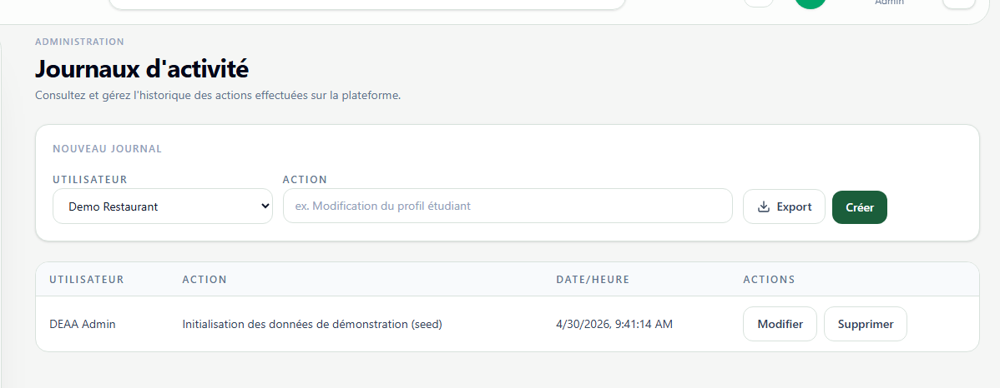

**Lien:** `/activity-logs`

### Objectif

Les journaux d'activite affichent les actions importantes effectuees dans l'application.

### Utilisation

- Consulter les actions recentes.
- Identifier l'utilisateur responsable d'une action.
- Verifier les creations, modifications et suppressions.
- Rechercher les operations sensibles si les filtres sont disponibles.

### Bonnes pratiques

- Restreindre l'acces aux administrateurs et responsables habilites.
- Consulter les journaux apres une operation critique.
- Utiliser les journaux pour les audits internes.

---

## Bonnes pratiques

### Avant de creer une donnee

- Rechercher d'abord pour eviter les doublons.
- Verifier les informations obligatoires.
- Respecter les formats utilises par l'etablissement.

### Avant de supprimer

- Verifier si la donnee est utilisee ailleurs.
- Preferer la desactivation quand l'historique doit etre conserve.
- Controler les impacts sur statistiques, notes, classes et reservations.

### Pour les imports

- Utiliser un fichier propre et structure.
- Verifier les colonnes avant import.
- Corriger les erreurs ligne par ligne quand un rapport est fourni.
- Faire un controle apres import.

### Pour les exports

- Appliquer les bons filtres.
- Nommer le fichier avec la date.
- Ne pas diffuser les donnees personnelles a des personnes non autorisees.

---

## Depannage rapide

| Probleme | Verification recommandee |
|---|---|
| Connexion impossible | Verifier identifiant, mot de passe et disponibilite du backend |
| Menu incomplet | Verifier le role utilisateur et les departements attribues |
| Donnees manquantes | Verifier les filtres actifs et le perimetre departement |
| Impossible de supprimer | La donnee est peut-etre utilisee ailleurs ou le role ne le permet pas |
| Notes non visibles en deliberation | Verifier la classe, le module, l'epreuve et les coefficients |
| Reservation refusee | Verifier conflit de salle, creneau ou droits d'approbation |
| Export incomplet | Verifier filtres, role et selection de champs |

---

## Idees d'amelioration

### Priorite haute

- Ajouter une recherche globale dans la barre superieure pour trouver rapidement etudiants, enseignants, classes, documents et demandes.
- Ajouter des notifications temps reel pour les reservations de salle, demandes administratives, messages et actions de restauration.
- Ajouter un centre d'aide integre avec liens vers ce manuel et une aide contextuelle par page.
- Ajouter une validation plus visible des conflits: salle deja reservee, enseignant occupe, notes manquantes, classe sans modules.
- Ajouter des tableaux de bord par role: direction, staff, enseignant, etudiant, restauration.

### Priorite moyenne

- Ajouter un workflow complet de documents manquants avec relances et statuts.
- Ajouter des exports PDF officiels: releves de notes, attestations, listes de classe, recus restauration.
- Ajouter un calendrier unifie combinant emploi du temps, reservations et evenements academiques.
- Ajouter un systeme d'import avec previsualisation, detection d'erreurs et rapport ligne par ligne.
- Ajouter des modeles de messages pour les communications repetitives.

### Priorite future

- Ajouter une application mobile ou une vue mobile etudiante pour notes, emploi du temps, ressources et restauration.
- Ajouter des statistiques avancees: progression par cohorte, taux de reussite, occupation des salles, charge enseignant.
- Ajouter une gestion fine des permissions par action, pas seulement par role.
- Ajouter une piste d'audit exportable pour les operations critiques.
- Ajouter un mode multilingue FR/AR/EN si l'application doit etre utilisee par plusieurs publics.

---

**Document:** Manuel d'utilisation DEAA-Hub  
**Format:** Markdown unique avec captures d'ecran  
**Derniere mise a jour:** 2026-04-28
