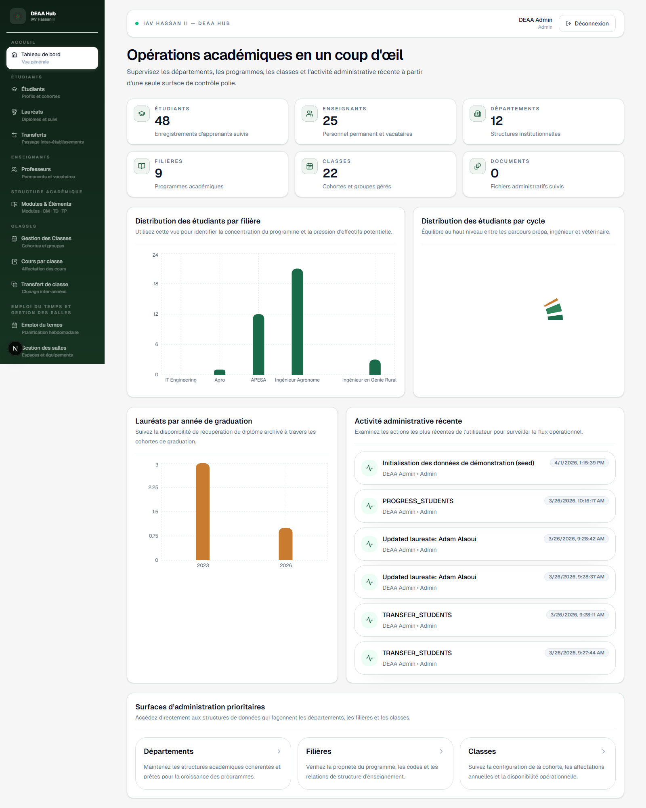
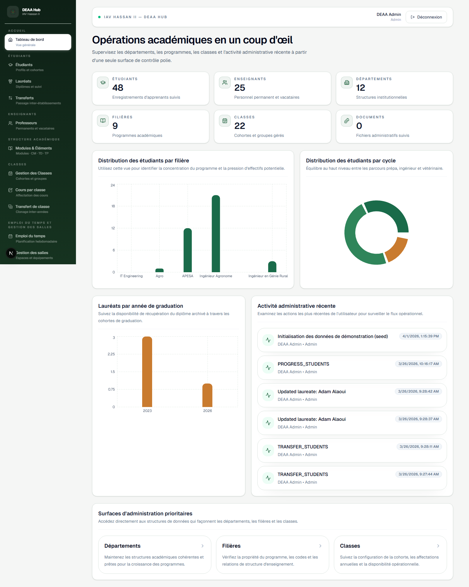
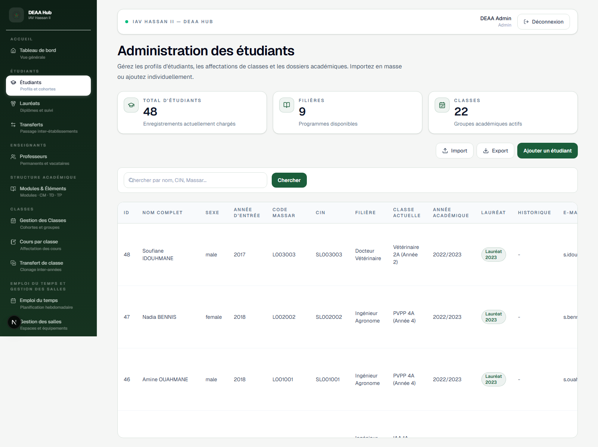
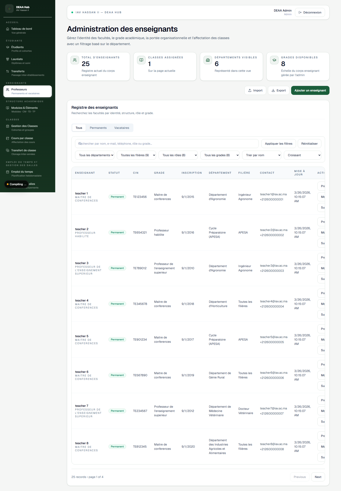
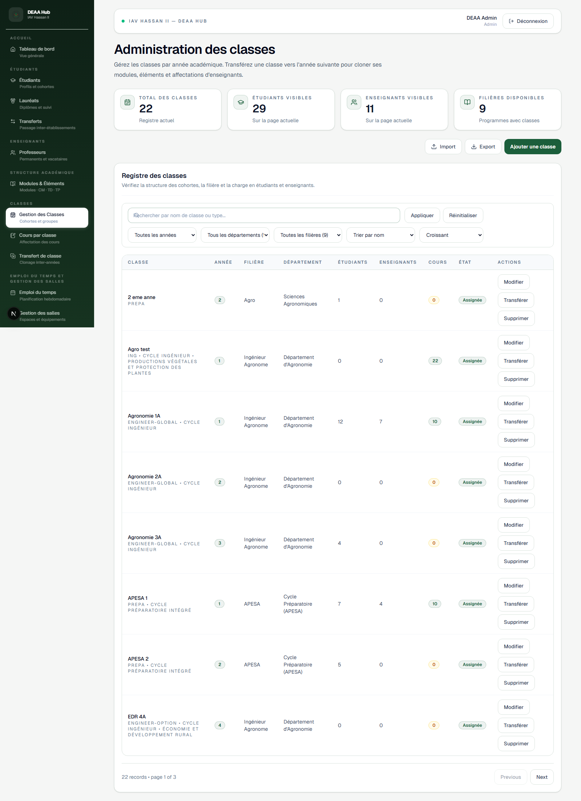
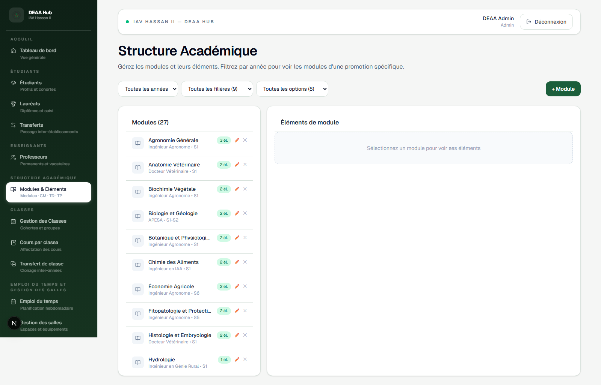
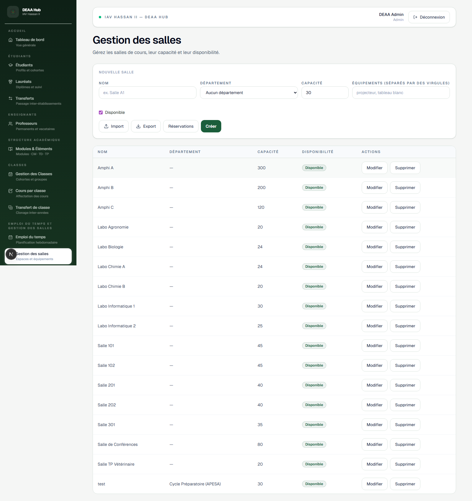
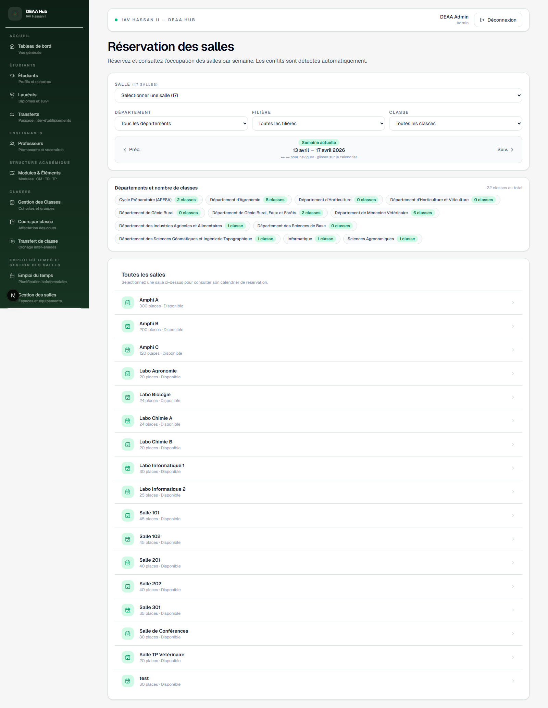

# DEAA-Hub Access & Department Scope Guide

_Last updated: 2026-04-14_

This document explains the current authorization behavior implemented in DEAA-Hub, with a focus on:

- department-scoped write permissions for `user` / `viewer`
- global read access for Students and Teachers (as requested)
- admin/staff behavior
- practical validation scenarios

It also includes screenshots of the current UI.

---

## 1) What changed (functional summary)

### Requested behavior now implemented

- `user` can **see all students and teachers**.
- `403 Forbidden` should occur only when `user` (or `viewer`) tries to:
  - **add** records outside assigned departments
  - **modify** records outside assigned departments
  - **delete** records outside assigned departments

### Department-scoped write enforcement

For role `user` and role `viewer`:

- write actions are allowed only if target entity belongs to one of `currentUser.departmentIds`
- out-of-scope writes return `403`

For role `admin` / `staff`:

- broader write access remains enabled

---

## 2) Login and navigation screenshots

> Default seeded admin credentials used for capture:
> - Identifier: `admin`
> - Password: `admin`

### Login



### Dashboard



### Students



### Teachers



### Classes



### Academic Modules / Element Modules



### Rooms



### Room Reservations



---

## 3) Permission model by area

## 3.1 Students

- Read:
  - list/read is available to `admin`, `staff`, `viewer`, `user`
  - **list is now global** (no department filter in controller)
- Write:
  - create/update/delete are allowed for `admin`, `staff`, `viewer`, `user`
  - for `viewer` / `user`: service enforces department ownership via class/filière department

Expected behavior:
- `GET /api/students` succeeds for user (global list)
- `POST/PATCH/DELETE /api/students...` returns `403` if target department not assigned

---

## 3.2 Teachers

- Read:
  - list/read available to `admin`, `staff`, `viewer`, `user`
  - list remains global
- Write:
  - create/update/delete available to `admin`, `staff`, `viewer`, `user`
  - for `viewer` / `user`: department ownership check enforced in service

Expected behavior:
- `GET /api/teachers` succeeds for user (global list)
- write outside assigned department returns `403`

---

## 3.3 Classes

- Read:
  - list/read for `admin`, `staff`, `viewer`, `user`
  - list can still be query-filtered by params; write scope is separate
- Write:
  - create/update/transfer/delete available to `admin`, `staff`, `viewer`, `user`
  - `viewer` / `user`: class department must belong to assigned departments
  - transfer validates both source and target department ownership

---

## 3.4 Academic Modules

- Read:
  - list/read for `admin`, `staff`, `viewer`, `user`
- Write:
  - create/update/delete/module-class assign/remove available to `admin`, `staff`, `viewer`, `user`
  - `viewer` / `user`: module and class departments must be in assigned departments

---

## 3.5 Element Modules

- Read:
  - list/read for `admin`, `staff`, `viewer`, `user`
- Write:
  - create/update/delete available to `admin`, `staff`, `viewer`, `user`
  - `viewer` / `user`: checked through parent module department ownership

---

## 3.6 Rooms

- Read:
  - list/read for `admin`, `staff`, `viewer`, `user`
- Write:
  - create/update/delete for `admin`, `staff`, `viewer`, `user`
  - `viewer` / `user`: allowed only in assigned departments

---

## 3.7 Room Reservations

- Reservation behavior remains aligned with previous request:
  - admin/inspector-side broad visibility and reservation workflows remain available
  - department consistency checks for room/class are enforced at service level

---

## 4) Quick API behavior matrix

| Area | Read for user | Write in assigned dept | Write outside assigned dept |
|---|---:|---:|---:|
| Students | ✅ | ✅ | ❌ `403` |
| Teachers | ✅ | ✅ | ❌ `403` |
| Classes | ✅ | ✅ | ❌ `403` |
| Academic Modules | ✅ | ✅ | ❌ `403` |
| Element Modules | ✅ | ✅ | ❌ `403` |
| Rooms | ✅ | ✅ | ❌ `403` |

---

## 5) Validation checklist (manual QA)

Use a non-admin account with known `departmentIds`.

1. **Students list visible**
   - Open Students page
   - confirm rows from multiple departments are visible

2. **Teachers list visible**
   - Open Teachers page
   - confirm rows are visible

3. **In-scope create/update/delete succeeds**
   - create or edit an entity in one assigned department
   - expected: success toast + saved data

4. **Out-of-scope write blocked**
   - attempt write against entity in non-assigned department
   - expected: `403` from API

5. **Class/module/element write checks**
   - try assignment/transfer targeting out-of-scope class
   - expected: `403`

---

## 6) Known operational notes

- If changes seem inconsistent in UI after role/scope updates, re-login to refresh token/session state.
- If backend reports `EADDRINUSE :5000`, another backend instance is already running.

---

## 7) How screenshots were generated

Script:
- `frontend/scripts/take-screenshots.mjs`

Output folder:
- `docs/screenshots/`

Run:

```text
cd frontend
node .\scripts\take-screenshots.mjs
```

---

## 8) Related implementation scope

The access logic was applied in backend modules for:

- students
- teachers
- classes
- academic-modules
- element-modules
- rooms

with role-aware service-level department ownership checks.
