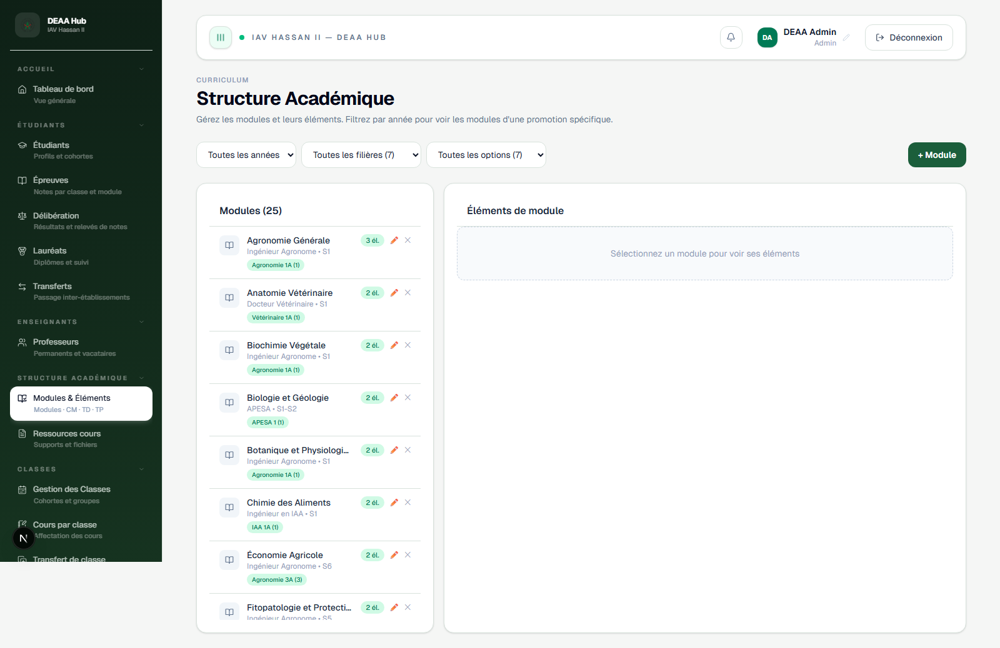

# Modules et elements

**Lien:** `/academic`

## Objectif

Cette page definit la structure pedagogique: modules, elements, coefficients et liens avec les classes.

## Utilisation

- Creer un module avec son code, semestre et informations pedagogiques.
- Ajouter des elements de module: CM, TD, TP ou autre composante.
- Assigner les modules et elements aux classes.
- Modifier les volumes horaires, coefficients ou rattachements.

## Points importants

- Les modules alimentent les pages Cours, Epreuves, Emploi du temps et Deliberation.
- Garder une nomenclature claire evite les doublons.
- Verifier les coefficients avant la saisie des notes.
