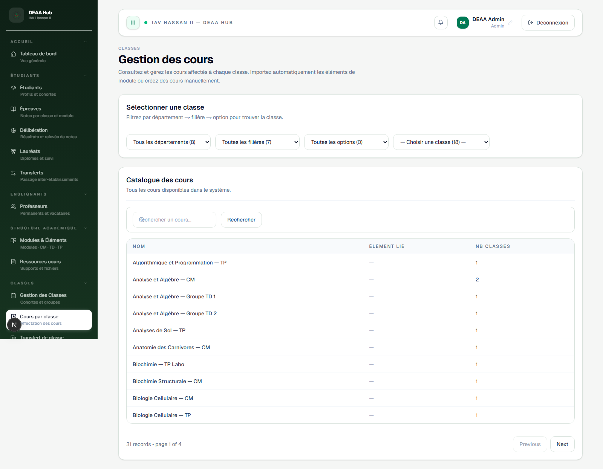

# Cours par classe

**Lien:** `/classes/cours`

## Objectif

Cette page permet d'affecter les cours et enseignants a une classe.

## Utilisation

- Selectionner une classe.
- Ajouter les elements de modules au plan de cours.
- Assigner un ou plusieurs enseignants.
- Modifier ou retirer une affectation.

## Points importants

- Les affectations sont reutilisees dans l'emploi du temps et les notes.
- Controler les enseignants avant de publier le planning.
- Les changements peuvent impacter plusieurs pages de l'application.
