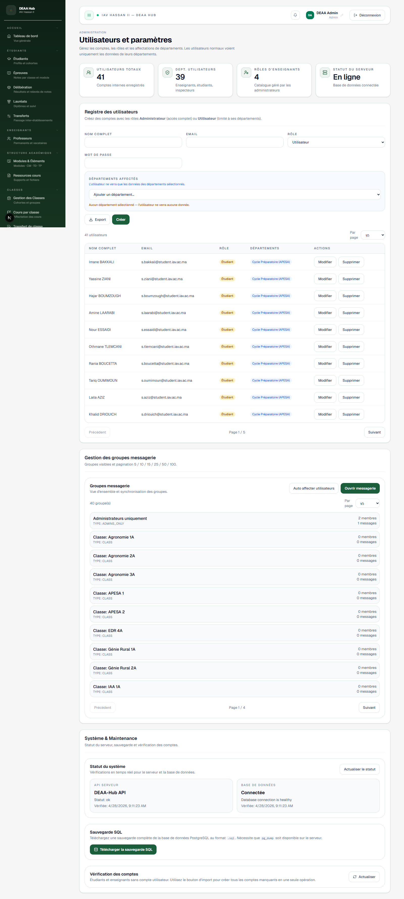

# Utilisateurs

**Lien:** `/users`

## Objectif

La page Utilisateurs gere les comptes, roles et perimetres d'acces.

## Utilisation

- Creer un utilisateur.
- Attribuer un role.
- Assigner un ou plusieurs departements.
- Modifier les informations du compte.
- Reinitialiser ou changer le mot de passe si disponible.
- Desactiver ou supprimer un compte selon les droits.

## Points importants

- Les comptes administrateurs ont un acces large.
- Les departements affectent la visibilite des donnees.
- Appliquer le principe du moindre privilege pour les nouveaux comptes.
