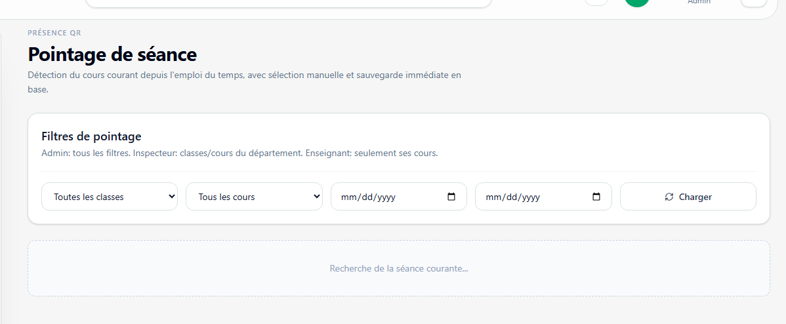

# Absence et presence

**Lien:** `/attendance`

## Objectif

Cette page permet de piloter le pointage de presence d'une seance, d'activer le QR temporaire et de consulter l'historique de presence selon le role.

## Utilisation

- Choisir la classe, le cours et la plage de dates pour retrouver une seance.
- Ouvrir la seance courante et activer le QR pour une duree limitee.
- Suivre en temps reel les presents, absents et statuts en attente.
- Corriger manuellement une presence si necessaire.
- Pour les etudiants, scanner le QR et consulter l'historique personnel.

## Points importants

- Le QR est temporaire et doit etre cloture a la fin de la seance.
- Les filtres aident a retrouver une seance si aucune seance courante n'est detectee.
- Les validations manuelles doivent rester exceptionnelles et justifiees.
