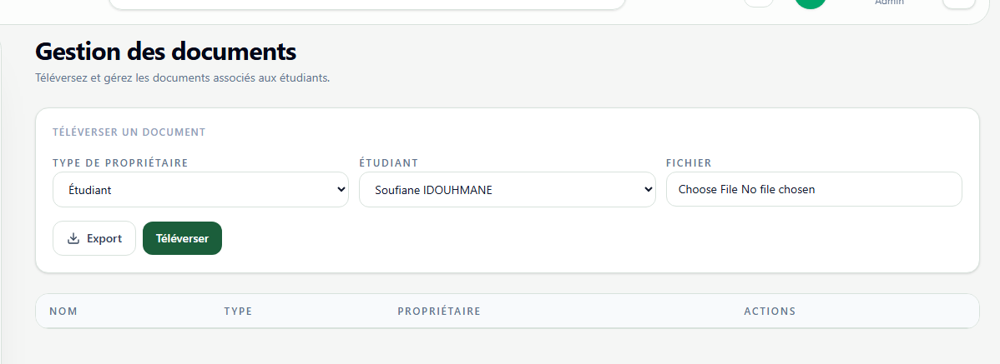

# Documents

**Lien:** `/documents`

## Objectif

La page Documents centralise le televersement et la gestion des pieces associees aux etudiants et aux enseignants.

## Utilisation

- Choisir le type de proprietaire: etudiant ou enseignant.
- Selectionner la personne concernee.
- Televerser un fichier autorise (`pdf`, `png`, `jpg`, `jpeg`).
- Renommer ou supprimer un document existant.
- Exporter la liste si besoin d'un suivi administratif.

## Points importants

- Verifier le bon proprietaire avant televersement.
- Utiliser des noms de fichiers clairs et standardises.
- Supprimer les doublons ou anciennes versions pour garder un dossier propre.
