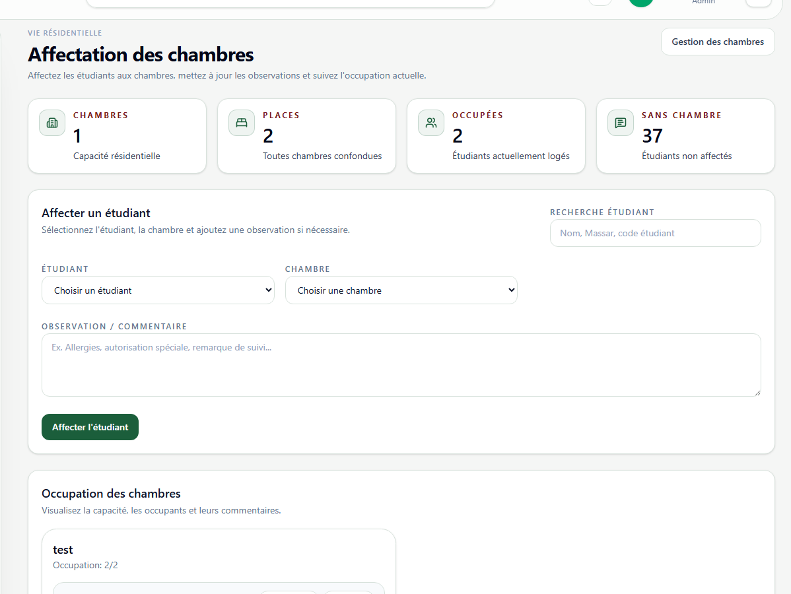

# Affectations internat

**Lien:** `/internat/affectations`

## Objectif

La page Affectations permet d'attribuer les etudiants aux chambres et de suivre les commentaires lies a l'hebergement.

## Utilisation

- Rechercher un etudiant par nom, code Massar ou code etudiant.
- Selectionner l'etudiant et la chambre cible.
- Ajouter une observation si necessaire.
- Modifier une affectation existante.
- Retirer un etudiant de l'internat si besoin.

## Points importants

- Verifier la place disponible avant attribution.
- Utiliser le champ commentaire pour les informations de suivi utiles.
- Toute reassignment doit etre repercutee rapidement pour garder un etat d'occupation fiable.
