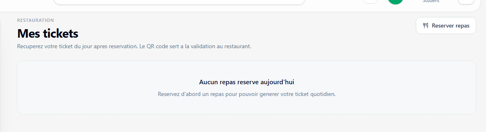

# Mes tickets restauration

**Lien:** `/restauration/tickets`

## Objectif

Cette page permet a l'etudiant de generer et presenter son ticket du jour apres reservation d'un repas.

## Utilisation

- Ouvrir la page apres avoir reserve un repas.
- Generer le ticket du jour si un repas confirme existe.
- Afficher le QR code ou le code ticket.
- Presenter le ticket au point de controle du restaurant.

## Points importants

- Sans reservation confirmee, aucun ticket ne peut etre genere.
- Un ticket est lie a la date du repas.
- En cas de probleme, revenir a la page Restauration pour verifier la reservation et le solde.
