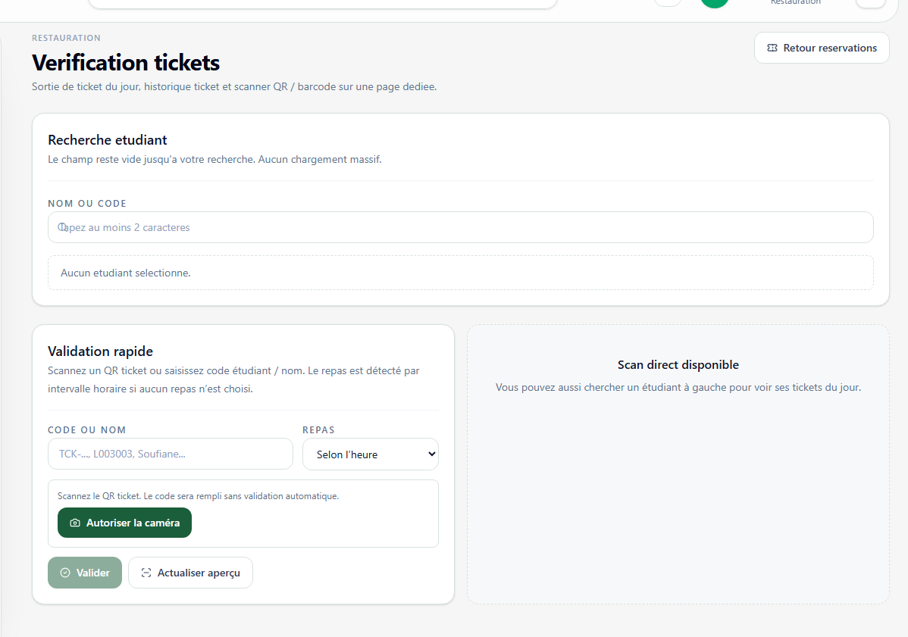

# Validation tickets

**Lien:** `/restauration/verification`

## Objectif

La page Validation tickets est reservee au personnel restauration pour verifier, sortir et consommer les tickets repas.

## Utilisation

- Rechercher un etudiant ou saisir un code ticket.
- Scanner un QR code ou un code-barres avec la camera.
- Verifier l'aperçu du ticket avant validation.
- Generer un ticket du jour si l'etudiant a une reservation valide.
- Marquer le ticket comme consomme apres remise du repas.

## Points importants

- La validation doit etre faite au moment du service.
- Le choix du repas peut etre automatique selon l'horaire ou force manuellement.
- Controler l'identite de l'etudiant en cas de doute avant consommation du ticket.
